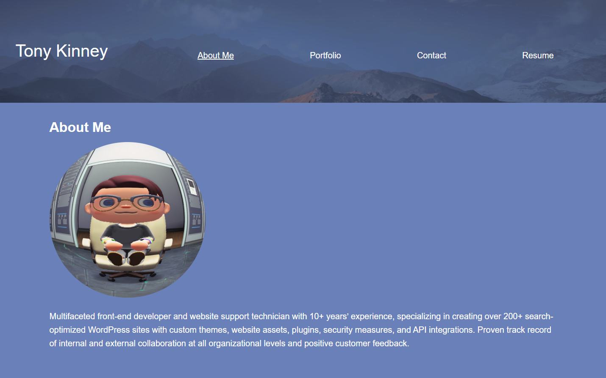

# React Portfolio

## Description

Professional Portfolio of work build using React.

## Table of Contents

- [Installation](#installation)
- [Usage](#usage)
- [Questions](#questions)
- [License](#license)

## Installation

No installation required. Application is deployed on Render.

## Usage

Use like a website. Navigate from page to page, click on links and enjoy!

## Contributing 

## Questions

Here is a link to my Github Profile: <a href="https://github.com/sketchyTK">blorbo</a>

## License
Please View https://opensource.org/licenses/gpl-3.0 for more information on this license.

## Live Deployment

<a href="https://react-portfolio-xh14.onrender.com/">Live Deployment on Render</a>
